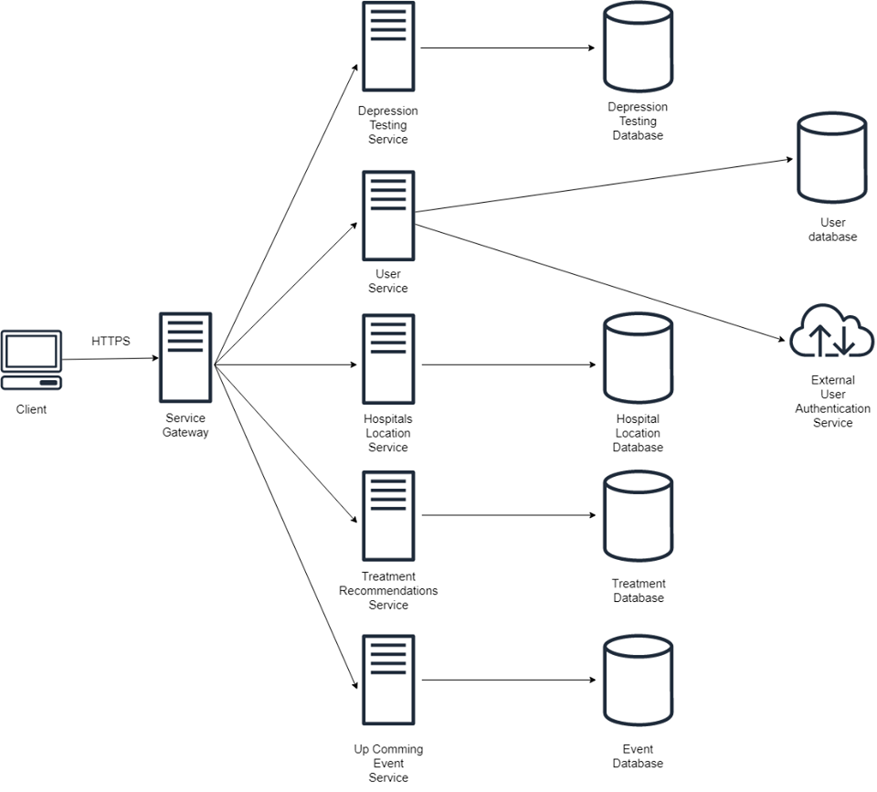

# Mor-Wai
> "หมอไว" Services for mental disorder (Depression) prevention and medical care.
## Presentation
> Slide: https://docs.google.com/presentation/d/1BZIsB1y6jIJ1eJHjpqhmk_XVLO7OzJEHKhPe7wGumFA/edit?usp=sharing
## Features
- ### Depression Inventory Test Services (แบบทดสอบประเมิณอาการโรคซึมเศร้า)
	- มีที่มาจากการศึกษางานวิจัยโรคซึมเศร้า, การปรึกษาแพทย์ และ นำมาทำเป็นแบบทดสอบโรคซึมเศร้าเพื่อประเมิณอาการโรคซึมเศร้าและประเภทของโรคซึมเศร้าที่เป็น
### 🌱  Usage
- #### ⭐ Get questions
  URL :  `/questions`
  Method :  `GET`
  **Response**
  Code :  `200`
  Example response :
```json
[
	{
		"questionID":  1,
		"questionTitle":  "รู้สึกซึม เศร้า หงุดหงิด หรือสิ้นหวัง",
		"choices":  [
			{
				"choiceID":  0,
				"choiceTitle":  "ไม่มีเลย",
				"choiceValue":  0
			},
			{
				"choiceID":  1,
				"choiceTitle":  "มีบางวัน",
				"choiceValue":  1
			},
			{
				"choiceID":  2,
				"choiceTitle":  "มีมากกว่า 7 วัน",
				"choiceValue":  2
			},
			{
				"choiceID":  3,
				"choiceTitle":  "มีแทบทุกวัน",
				"choiceValue":  3
			}
		]
	},
	...
	{
		"questionID":  9,
		"questionTitle":  "คิดว่าถ้าตายไปเสียจะดีกว่า หรือคิดจะทำร้ายตัวเองด้วยวิธีใดวิธีหนึ่ง",
		"choices":  [
			{
				"choiceID":  0,
				"choiceTitle":  "ไม่มีเลย",
				"choiceValue":  0
			},
			{
				"choiceID":  1,
				"choiceTitle":  "มีบางวัน",
				"choiceValue":  1
			},
			{
				"choiceID":  2,
				"choiceTitle":  "มีมากกว่า 7 วัน",
				"choiceValue":  2
			},
			{
				"choiceID":  3,
				"choiceTitle":  "มีแทบทุกวัน",
				"choiceValue":  3
			}
		]
	}
]
```

- #### ⭐ Get questions by ID
  URL :  `/questions/{id}`
  Method :  `GET`
  **Response**
  Code :  `200`
  Example response :
```json
{
	"questionID":  1,
	"questionTitle":  "รู้สึกซึม เศร้า หงุดหงิด หรือสิ้นหวัง",
	"choices":  [
		{
			"choiceID":  0,
			"choiceTitle":  "ไม่มีเลย",
			"choiceValue":  0
		},
		{
			"choiceID":  1,
			"choiceTitle":  "มีบางวัน",
			"choiceValue":  1
		},
		{
			"choiceID":  2,
			"choiceTitle":  "มีมากกว่า 7 วัน",
			"choiceValue":  2
		},
		{
			"choiceID":  3,
			"choiceTitle":  "มีแทบทุกวัน",
			"choiceValue":  3
		}
	]
}
```

- #### ⭐ Interpretation
  URL :  `/interpretation`
  Method :  `POST`
  **Response**
  Code :  `200`
  Example body :
```json
{
	"answers": [
		{
			"questionID": 1,
			"selectedChoice": 1
		},
		{
			"questionID": 2,
			"selectedChoice": 1
		},
		{
			"questionID": 3,
			"selectedChoice": 1
		},
		{
			"questionID": 4,
			"selectedChoice": 1
		},
		{
			"questionID": 5,
			"selectedChoice": 1
		},
		{
			"questionID": 6,
			"selectedChoice": 1
		},
		{
			"questionID": 7,
			"selectedChoice": 1
		},
		{
			"questionID": 8,
			"selectedChoice": 1
		},
		{
			"questionID": 9,
			"selectedChoice": 1
		}
	]
}
```
  Example response :
```json
{
	"totalScore":  9,
	"depressionSeverity":  "มีภาวะซึมเศร้าเล็กน้อย"
}
```

---
- ### User Services
	- Authentication part
	- User's Profile

---
- ### Hospital Location Service
	-	ค้นหาโรงพยาบาลที่ใกล้เคียงซึ่งมีจิตแพทย์พร้อมให้การรักษา
  - 🌱 Usage
    - get all location
    ```
        GET http://35.225.198.249:8000/location/
    ```

    ```python
      # Response Type
        [
          {
              "id": int,
              "name": string,
              "description": string,
              "created_at": string,
              "latitude": float,
              "longitude": float
          }
        ]
    ```
    - add location
    ```
        POST http://35.225.198.249:8000/location/
    ```
    ```python
        # Payload Type
        [
          {
            "name": string,
            "description": string,
            "latitude": float,
            "longitude": float
          }
        ]
    ```

    - get specific location
    ```
        GET http://35.225.198.249:8000/location/<id>
    ```

    ```python
      # Response Type
        {
          "id": int,
          "name": string,
          "description": string,
          "created_at": string,
          "latitude": float,
          "longitude": float
        }
    ```

    - edit location infomation
    ```
        PATCH http://35.225.198.249:8000/location/<id>
    ```
    ```
        PUT http://35.225.198.249:8000/location/<id>
    ```

    ```python
        # Payload Type
        # PUT requires all fields, patch otherwise
        [
          {
              "name": string,
              "description": string,
              "latitude": float,
              "longitude": float
          }
        ]
    ```

    - delete location infomation
    ```
        DELETE http://35.225.198.249:8000/location/<id>
    ```

    - get filter location using user location
    ```
        GET http://35.225.198.249:8000/location/filter
    ```
    ```python
        # Parameter
        lat = "float: user's latitude"
        lon = "float: user's longitude"
        km = "float: filter distance"
    ```
    ```python
        # Response Type
        [
          {
              "id": int,
              "name": string,
              "description": string,
              "created_at": string,
              "latitude": float,
              "longitude": float
          }
        ]
    ```

---
- ### Treatment Recommendations Services
	- ให้คำแนะนำเกี่ยวกับการรักษาโรคซึมเศร้า ทั้งในด้านการดูแลตนเองและแนวทางการรักษาของแพทย์
	- ทำการรับคะแนนที่ได้จาก Depression Test Service มาให้คำแนะนำในการรักษา<br>
		- รับคำแนะนำการรักษา
		**URL**: `http://34.69.92.81/suggest/suggestion/{total_score}` **Method**: `GET`
		***หมายเหตุ : เพื่อป้องกันข้อผิดพลาดด้านการแสดงผลกรุณาใช้ Postman**  
			- Get Suggestion
			- **Response :**
		```json
		{

		"id": 5,

		"depressed_level": "มีภาวะซึมเศร้าปานกลาง",

		"text": "ควรพักผ่อนให้เพียงพอ นอนหลับให้ได้ 6-8 ชั่วโมง ออกกำลังกายสม่ำเสมอ ทำกิจกรรมที่ทำให้ผ่อนคลาย พบปะเพื่อนฝูง ควรขอคำปรึกษาช่วยเหลือจากผู้ที่ไว้วางใจ ไม่จมอยู่กับปัญหา มองหาหนทางคลี่คลาย หากอาการที่ท่านเป็นมีผลกระทบต่อการทำงานหรือการเข้าสังคม (อาการซึมเศร้าทำให้ท่านมีปัญหาในการทำงาน การดูแลสิ่งต่างๆ ในบ้าน หรือการเข้ากับผู้คน ในระดับมากถึงมากที่สุด) หรือหากท่านมีอาการระดับนี้มานาน 1-2 สัปดาห์แล้วยังไม่ดีขึ้น ควรพบแพทย์เพื่อรับการช่วยเหลือรักษา"

		}
		```
		- ดูคำแนะนำการรักษาทั้งหมด
		**URL :** `http://34.69.92.81/suggest/suggestion_list` **Method**: `GET`
		***หมายเหตุ : เพื่อป้องกันข้อผิดพลาดด้านการแสดงผลกรุณาใช้ Postman**
			- Get Suggestion List
			- **Response**
		```json
		[

		{

		"id": 3,

		"depressed_level": "ไม่มีภาวะซึมเศร้า",

		"text": "ไม่จำเป็นต้องรักษา"

		},

		{

		"id": 4,

		"depressed_level": "มีภาวะซึมเศร้าเล็กน้อย",

		"text": "ควรพักผ่อนให้เพียงพอ นอนหลับให้ได้ 6-8 ชั่วโมง ออกกำลังกายสม่ำเสมอ ทำกิจกรรมที่ทำให้ผ่อนคลาย พบปะเพื่อนฝูง ควรทำแบบประเมินอีกครั้งใน 1 สัปดาห์"

		},

		{

		"id": 5,

		"depressed_level": "มีภาวะซึมเศร้าปานกลาง",

		"text": "ควรพักผ่อนให้เพียงพอ นอนหลับให้ได้ 6-8 ชั่วโมง ออกกำลังกายสม่ำเสมอ ทำกิจกรรมที่ทำให้ผ่อนคลาย พบปะเพื่อนฝูง ควรขอคำปรึกษาช่วยเหลือจากผู้ที่ไว้วางใจ ไม่จมอยู่กับปัญหา มองหาหนทางคลี่คลาย หากอาการที่ท่านเป็นมีผลกระทบต่อการทำงานหรือการเข้าสังคม (อาการซึมเศร้าทำให้ท่านมีปัญหาในการทำงาน การดูแลสิ่งต่างๆ ในบ้าน หรือการเข้ากับผู้คน ในระดับมากถึงมากที่สุด) หรือหากท่านมีอาการระดับนี้มานาน 1-2 สัปดาห์แล้วยังไม่ดีขึ้น ควรพบแพทย์เพื่อรับการช่วยเหลือรักษา"

		},

		{

		"id": 6,

		"depressed_level": "มีภาวะซึมเศร้ามาก",

		"text": "ควรพบแพทย์เพื่อประเมินอาการและให้การรักษา ระหว่างนี้ควรพักผ่อนให้เพียงพอ นอนหลับให้ได้ 6-8 ชั่วโมง ออกกำลังกายเบาๆ ทำกิจกรรมที่ทำให้ผ่อนคลาย ไม่เก็บตัว และควรขอคำปรึกษาช่วยเหลือจากผู้ใกล้ชิด"

		},

		{

		"id": 7,

		"depressed_level": "มีภาวะซึมเศร้ารุนแรง",

		"text": "ต้องพบแพทย์เพื่อประเมินอาการและให้การรักษาโดยด่วน ไม่ควรปล่อยทิ้งไว้"

		}

		]
		```

---
- ### Up-Coming Events Service
	- แนะนำ Events ที่มีส่วนช่วยพัฒนาสุขภาพจิต และ ป้องกัน Mental Disorder ที่ถูกจัดขึ้นในประเทศไทย เช่น กิจกรรรมของ Chula-Wellness

## Use Case


## Micro-Services Overview

